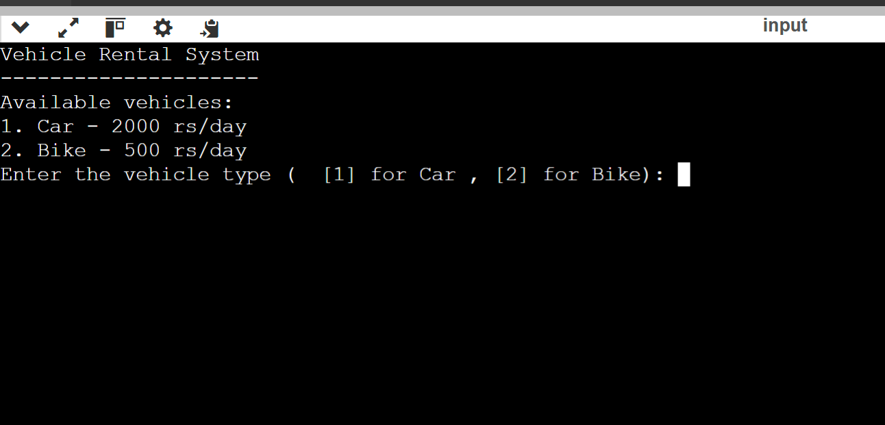
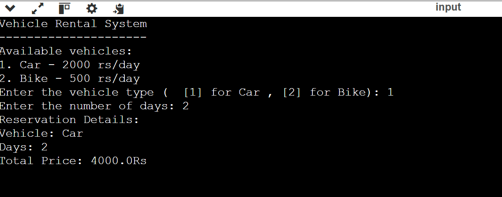
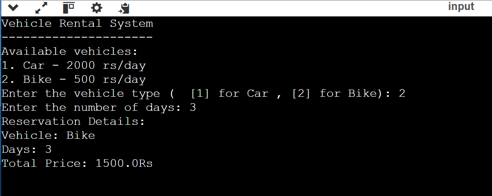
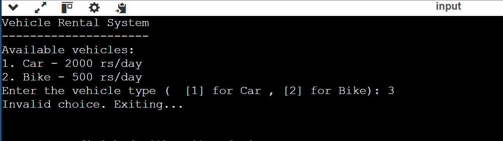

# Vechile-Rental-System
## Description
This is a simple console-based Vehicle Rental System implemented in Java. The program allows users to rent either a car or a bike for a specified number of days, and it calculates the total rental cost based on the type of vehicle and the number of days rented.
## Features
Vehicle Types: Users can choose between renting a Car or a Bike.
Pricing: The rental price is calculated based on the type of vehicle and the number of rental days.
Simple Console Interface: The program runs in the console and uses simple text-based input/output for user interaction.
Object-Oriented Design: The program utilizes basic OOP principles such as classes, inheritance, encapsulation, and polymorphism.
## Classes Used
Vehicle: The base class representing a generic vehicle.
Car: A subclass of Vehicle representing a car with a specific daily rental rate.
Bike: A subclass of Vehicle representing a bike with a specific daily rental rate.
Reservation: A class that handles the reservation details and calculates the total rental cost.
## Requirements
Java Development Kit (JDK) 8 or later
A terminal or command line to compile and run the program
## Compilation
Save the source code in a file named VehicleRental.java.
Open a terminal or command line and navigate to the directory where the VehicleRental.java file is located.
## Conclusion
The Vehicle Rental System provides a straightforward example of how object-oriented programming (OOP) principles can be applied in Java to create a simple, yet functional, application. By using classes and inheritance, the program models different types of vehicles and their respective pricing. Encapsulation ensures that each class manages its data, while polymorphism allows for flexible handling of different vehicle types. This project serves as a practical introduction to OOP concepts and how they can be implemented to solve real-world problems in a clean and organized manner.
## Output

